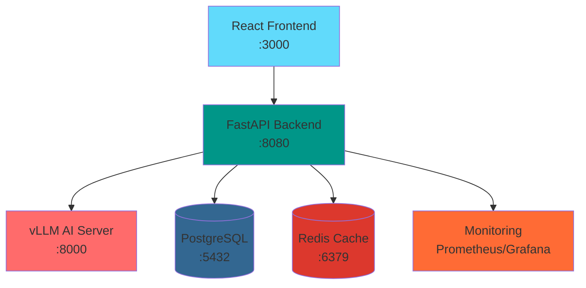

# 🎲 D&D AI Game System

<div align="center">
  


</div>

## 🎯 What This Project Is

This is my learning project exploring how to build a production-like system with multiple containerized services. I'm working on integrating AI models for D&D gameplay while learning about system architecture, monitoring, and DevOps practices.

**Current Status**: 🚧 **Early Development** - Core infrastructure working, game logic in progress

## 🏗️ Architecture



## ✅ What's Working

| Component | Status | Notes |
|-----------|--------|-------|
| 🐳 Container Orchestration | ✅ Working | 15 services via Docker Compose |
| 🗄️ Database | ✅ Working | PostgreSQL with proper schemas |
| ⚡ Caching | ✅ Working | Redis integration |
| 🚀 API | ✅ Working | FastAPI with basic endpoints |
| 🎨 Frontend | ✅ Working | React app with basic UI |
| 📊 Monitoring | ✅ Working | Prometheus + Grafana dashboards |
| 🤖 AI Server | ⚠️ Limited | vLLM running, memory constrained |

## 🚧 What's In Progress

<details>
<summary><strong>🎮 Game Logic</strong></summary>
<br>

- Simple random mechanics implemented
- Needs expansion for full D&D rules
- Combat system placeholder ready

</details>

<details>
<summary><strong>🤖 AI Integration</strong></summary>
<br>

- Can handle ~2 prompts before memory issues
- TheBloke/TinyLlama-1.1B-Chat-v1.0-AWQ"
- RTX 2060 6GB VRAM limitations (thus quantized model)
- Context management needs optimization

</details>

<details>
<summary><strong>🔌 Real-time Features</strong></summary>
<br>

- WebSocket infrastructure planned
- Live dice rolling system designed
- Multi-player sessions architecture ready

</details>

<details>
<summary><strong>🎨 Frontend Polish</strong></summary>
<br>

- Basic functionality complete
- UI/UX improvements needed
- Mobile responsiveness pending

</details>

## ❌ Known Issues

- **Filebeat**: Log shipping not working properly, configuration issues
- **Memory Limitations**: RTX 2060 6GB struggles with longer conversations
- **Worker Service**: Very basic implementation, game logic incomplete
- **Model Context**: Limited conversation history due to VRAM constraints
- **Error Handling**: Basic error handling, needs improvement

## 🛠️ Tech Stack

**Backend**: FastAPI, PostgreSQL, Redis, Python  
**Frontend**: React, TypeScript  
**AI**: vLLM (limited by hardware)  
**Infrastructure**: Docker Compose, Nginx  
**Monitoring**: Prometheus, Grafana, Elasticsearch, Kibana  

## 🚀 Quick Start

<div align="center">

### Prerequisites
RTX 2060+ | 16GB RAM | Docker | NVIDIA Container Toolkit

</div>

```bash
# 1. Clone repository
git clone <repo-url>
cd dungeons_and_deamons

# 2. Start all services
docker-compose up -d

# 3. Check service health
docker-compose ps

# 4. View real-time logs
docker-compose logs -f api_server
```

<div align="center">

### 🌐 Access Points

| Service | URL | Credentials |
|---------|-----|-------------|
| 🎮 Game Interface | http://localhost:3000 | - |
| 📚 API Documentation | http://localhost:8080/docs | - |
| 📊 Grafana Dashboard | http://localhost:3001 | admin/admin123 |
| 🔍 Prometheus Metrics | http://localhost:9090 | - |

</div>

## 📊 Current Limitations

> ⚠️ **Hardware Constraints**: This project is optimized for consumer-grade hardware

| Limitation | Impact | Workaround |
|------------|--------|------------|
| 🎮 RTX 2060 6GB VRAM | ~2-3 AI exchanges max | Context compression planned |
| ⏱️ Response Times | 2-10s depending on complexity | Async processing implemented |
| 🔄 Single GPU Setup | No load balancing | Horizontal scaling designed |
| 📝 Context Length | Limited conversation history | Sliding window technique |  


## 🎲 Game Features (Planned/WIP)

- [ ] Character creation and management
- [ ] Basic dice rolling mechanics  
- [ ] AI-generated story content (limited)
- [ ] Turn-based combat system
- [ ] Inventory and progression
- [ ] Multi-player sessions

## 🔮 Next Steps

**Short Term**:
- Fix memory management for longer AI conversations
- Complete basic game mechanics in worker service
- Resolve Filebeat logging issues
- Improve error handling and user feedback

**Medium Term**:
- Implement WebSocket for real-time gameplay
- Add user authentication and sessions
- Optimize AI model performance
- Create proper game state persistence

## 💡 Why This Project?

This project combines my interests in:
- **Full-stack development** with modern tools
- **AI/ML integration** in practical applications  
- **System architecture** and containerization
- **Gaming** i like dnd if not obvious

---
